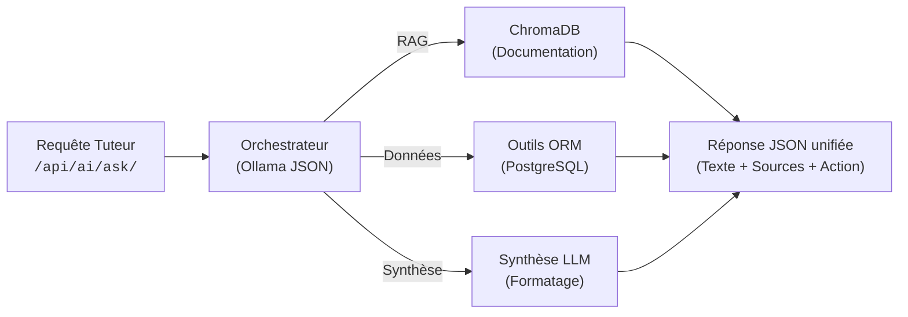
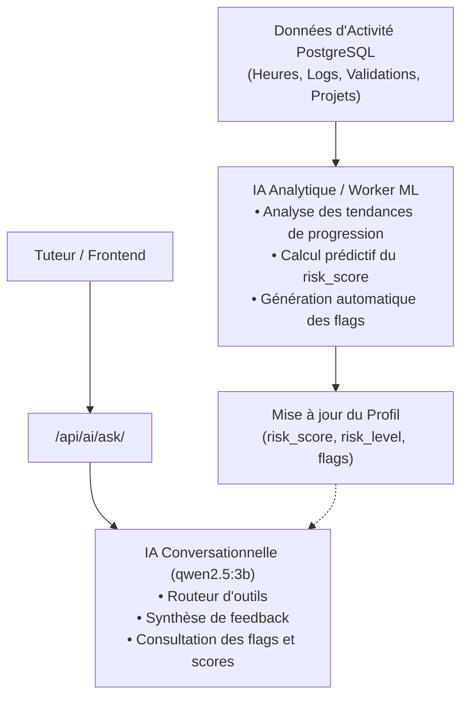

# AI Support Agent & RAG System 🤖

> **Architecture, Modules & Guide d'Intégration Frontend** — Point d'entrée unique d'orchestration IA, RAG documentaire, pilotage pédagogique PostgreSQL et perspectives d'analyse prédictive.

---

## 🏗️ Architecture & Fonctionnement

Le système IA repose sur le modèle local **`qwen2.5:3b`** servi par **Ollama** au sein du réseau Docker interne.

Pour éviter de multiplier les endpoints complexes côté client, nous avons conçu un **routeur d'intention unique** : le frontend envoie simplement le message du tuteur à `/api/ai/ask/`, et le backend sélectionne dynamiquement la meilleure stratégie d'exécution.



### Les trois piliers du système

1. **Le RAG documentaire (ChromaDB) :**
   * Au démarrage du conteneur, un script d'ingestion découpe et vectorise l'ensemble de la documentation 42 (règlement intérieur, norme C, guides d'évaluation, etc.) dans une base vectorielle persistante.
   * Lorsqu'une question porte sur la pédagogie ou les règles, l'IA effectue une recherche sémantique de proximité et répond fidèlement en citant les fichiers sources.

2. **Le catalogue d'outils ORM (PostgreSQL) :**
   * L'IA n'exécute jamais de requêtes SQL brutes arbitraires.
   * Elle dispose d'outils Python déterministes branchés sur l'ORM Django (`Profil`, `Project`) capables de :
     * Analyser les réussites et échecs sur un projet ou examen (`get_students_by_project`, `get_exam_stats`).
     * Lister les étudiants en situation de risque ou de décrochage (`get_students_at_risk`).
     * Détecter les étudiants en manque de points de correction (`get_students_low_correction_points`).
     * Suivre la présence en cluster et l'assiduité horaire (`get_presence_stats`).
     * Détecter les écarts de progression entre les days validés et les days en cours (`get_students_with_day_gap`).

3. **Le générateur de synthèses (Summarizer) :**
   * L'IA reformule les notes brutes rédigées par les tuteurs, synthétiques ($\le 200$ caractères) et adaptées aux dossiers étudiants.
   * Elle prépare automatiquement un payload d'action prêt pour le frontend.

---

## 💻 Guide d'Intégration Frontend

Toutes les interactions avec l'IA passent par une seule route POST sécurisée via le reverse proxy Nginx.

### 1. Spécification de l'API

* **URL :** `https://localhost/api/ai/ask/`
* **Méthode :** `POST`
* **En-têtes :** `Content-Type: application/json`
* **Identifiants de session :** `credentials: "include"` (pour conserver la session tuteur connectée)

#### Format de la requête (Body JSON)
```json
{
  "query": "Donne-moi les piscineux qui ont validé le C00"
}
```

#### Format de la réponse unifiée (200 OK)
```json
{
  "query": "Donne-moi les piscineux qui ont validé le C00",
  "answer": "Au total, 286 étudiants ont validé l'examen C00.",
  "sources": [
    "PostgreSQL: auth42"
  ],
  "action": null
}
```

#### Format de la réponse avec proposition d'action (Résumé de feedback)
Si le tuteur demande de résumer ou de reformuler une note, le champ `action` contient les informations prêtes à être envoyées à la route de commentaire :

```json
{
  "query": "Résume ça pour etoad : bloqué sur segfault C02 pendant 3h",
  "answer": "Voici une proposition de synthèse pour **etoad** :\n\n> Étudiant motivé, blocage 3h sur segfault. Aide requise sur pointeurs C02.",
  "sources": [],
  "action": {
    "action_type": "add_comment",
    "target_login": "etoad",
    "suggested_text": "Étudiant motivé, blocage 3h sur segfault. Aide requise sur pointeurs C02."
  }
}
```

---

### 2. Comment brancher le bouton d'action contextuel ?

Lorsque `data.action` n'est pas `null` et que `data.action.action_type === "add_comment"` :
1. Afficher un encart interactif sous le message avec un bouton **« Ajouter au profil de {target_login} »**.
2. Au clic sur ce bouton, appeler directement l'endpoint déjà en place sur le backend :
   * **Route :** `POST /auth/comment/<target_login>/`
   * **Body :** `JSON.stringify({ content: action.suggested_text })`

---

## 🎯 Avancement & Reste à Valider (WIP)


| Module visé au barème | Fonctionnalité technique | Côté Backend | Côté Frontend | Statut évaluation |
|---|---|:---:|:---:|:---:|
| **RAG Documentaire (Majeur 2 pts)** | Ingestion vectorielle des règles 42 | ✅ Validé | — | ✅ Prêt |
| | Recherche sémantique ChromaDB | ✅ Validé | — | ✅ Prêt |
| | Rendu des réponses et badges de sources | ✅ API prête | ⏳ À intégrer | 🟡 En attente UI |
| **Utilisation d'un ORM (Mineur 1 pt)** | Requêtes sécurisées PostgreSQL via Django | ✅ Validé | — | ✅ Prêt |
| **Agent Autonome (Module au choix 2 pts)** | Routage dynamique et catalogue d'outils | ✅ Validé | — | ✅ Prêt |
| | Détection des écarts de progression (*day gap*) | ✅ Validé | — | ✅ Prêt |
| | Génération d'action contextuelle (`add_comment`) | ✅ Validé | ⏳ Bouton à brancher | 🟡 En attente UI |
| **Interface LLM Complète (Majeur 2 pts)** | Gestion d'erreurs et robustesse JSON | ✅ Validé | — | ✅ Prêt |
| | Réponses en flux continu (*Streaming* SSE/WS) | ⏳ À implémenter | ⏳ À brancher | 🔴 Non démarré |
| | Limitation de débit (*Rate limiting*) | ⏳ À configurer | — | 🔴 Non démarré |
| | Apprentissage/automatisation flags | ⏳ À envisager | — | 🔴 Non démarré |

---

## 🔮 Perspectives : Scoring Prédictif & Automatisation des Flags (AI Learning)

### 1. Objectif du moteur d'apprentissage
L'ambition de ce volet est d'automatiser la détection du décrochage pédagogique sans attendre une intervention manuelle du tuteur :
* **Calcul prédictif du `risk_score` :** entraîner un modèle sur les signaux faibles (stagnation prolongée sur un projet C, baisse soudaine de la moyenne d'heures en cluster, échecs successifs aux examens ou épuisement précoce des points de correction).
* **Attribution automatique du `risk_level` :** qualifier dynamiquement la criticité de l'étudiant (`ok`, `warning`, `critical`) directement sur son profil.
* **Génération de flags d'alerte :** marquer proactivement les dossiers à surveiller dans le tableau de bord du tuteur (ex. *« Risque de décrochage C03 »*, *« Absence prolongée constatée »*).

### 2. Architecture Multi-Modèles envisagée
Pour éviter de saturer le modèle conversationnel avec des calculs continus, le système s'orienterait vers une séparation nette des responsabilités :



---

## 🧪 Commandes de Test & Validation Rapide (CLI)

Vérification du bon fonctionnement de chaque intention avec curl :

```bash

# 1. Test RAG Documentaire (Consignes & Règlement)
curl -k -X POST https://localhost/api/ai/ask/ \
  -H "Content-Type: application/json" \
  -d '{"query": "Comment fonctionne la notation des peer-evaluations ?"}'

# 2. Test ORM : Bilan d'un projet ou examen
curl -k -X POST https://localhost/api/ai/ask/ \
  -H "Content-Type: application/json" \
  -d '{"query": "Combien de piscineux ont validé le C00 ?"}'

# 3. Test ORM : Étudiants manquant de points de correction
curl -k -X POST https://localhost/api/ai/ask/ \
  -H "Content-Type: application/json" \
  -d '{"query": "Qui n'\''a presque plus de points de correction ?"}'

# 4. Test ORM : Analyse de décrochage (écart de progression)
curl -k -X POST https://localhost/api/ai/ask/ \
  -H "Content-Type: application/json" \
  -d '{"query": "Donne-moi les piscineux avec un écart de plus de 2 jours entre leurs projets valides et en cours"}'

# 5. Test Résumé de feedback avec génération d'action
curl -k -X POST https://localhost/api/ai/ask/ \
  -H "Content-Type: application/json" \
  -d '{"query": "Peux-tu me résumer ça pour le profil de etoad : Le piscineux est motivé mais bloque sur les pointeurs du C02."}'

```